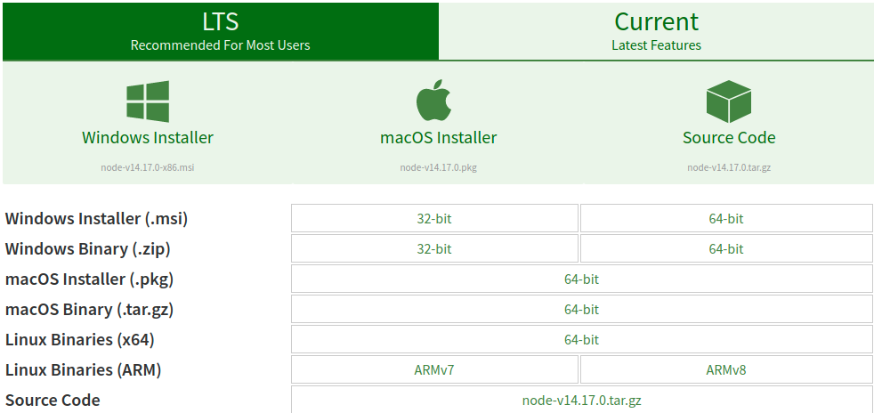

# Node.js

<hr/>

<hr/>

## Install Node.js

=== "Windows"

     Don't forget to add Node's path to your environement variables if the installer doesn't do it automatically.

    <figure>
        
        <figcaption>Image: Node.js Windows Installation</figcaption>
    </figure>

=== "MacOS"

    <figure>
        
        <figcaption>Image: Node.js MacOS Installation</figcaption>
    </figure>

=== "Linux"

    ```sh
    cd ~
    curl -sL https://deb.nodesource.com/setup_14.x -o nodesource_setup.sh
    ```

    ```sh
    nano nodesource_setup.sh
    sudo bash nodesource_setup.sh
    ```

    ```sh
    sudo apt install nodejs
    node -v
    ```

=== "Node Version"

    ```
    node -v
    ```

=== "NPM Version"

    NPM is the official Node Package Manager of Node.js, it comes with Node.

    ```
    npm -v
    ```

<hr/>

## Install Project Dependencies

=== "Client"

    ```bash
    // NPM
    cd Client
    npm install
    ```

    ```bash
    // Yarn
    cd Client
    yarn install

    ```

=== "Server"

    ```bash
    // NPM
    cd Server
    npm install
    ```

    ```bash
    // Yarn
    cd Server
    yarn install

    ```

<hr/>

## Run Application

=== "Script"

```bash
// NPM
cd Server
npm run dev
```

```bash
// Yarn
cd Server
yarn run dev
```

<hr />

## Sources

| Source                                 |    Author     | Link                                                                                            |
| :------------------------------------- | :-----------: | :---------------------------------------------------------------------------------------------- |
| How To Install Node.js on Ubuntu 20.04 | Digital Ocean | [Link](https://www.digitalocean.com/community/tutorials/how-to-install-node-js-on-ubuntu-20-04) |

<hr />
